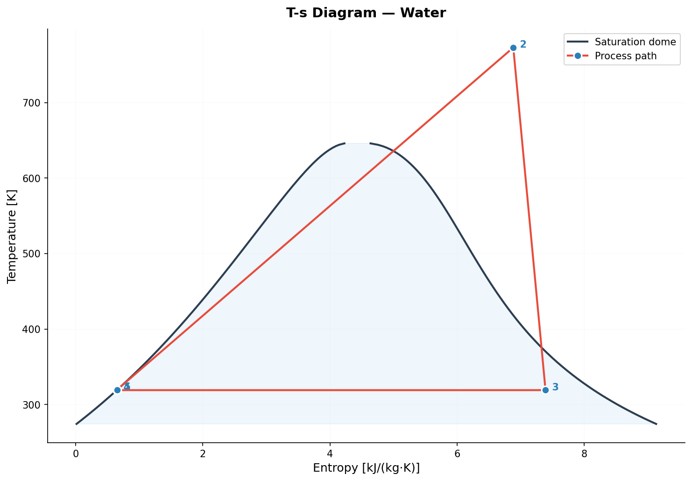
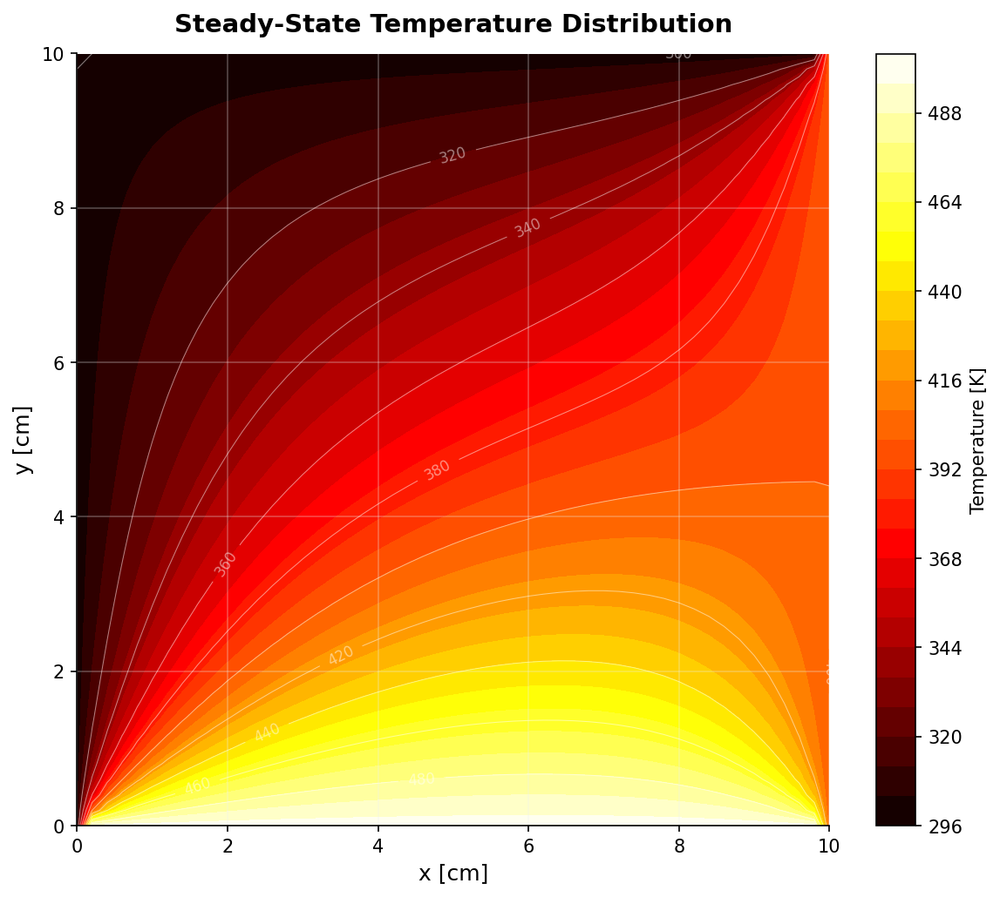
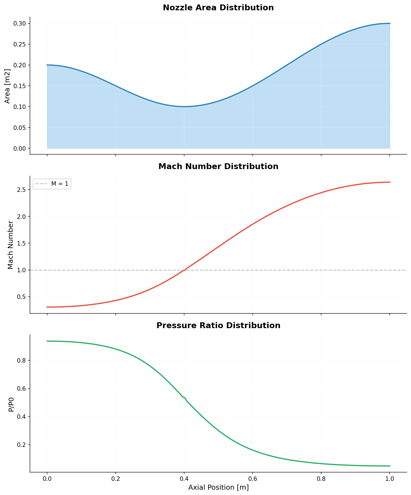

# Thermo-Sim

**Thermodynamic simulation toolkit** — cycle analysis, heat transfer modeling, and system optimization in Python.


## Overview

A collection of thermodynamic simulations demonstrating real-fluid property modeling, numerical methods, and engineering analysis. Built as a modular Python package with shared utilities, validated solvers, and clear visualizations.

```
thermo-sim/
├── thermosim/           # Shared library: fluid properties, solvers, plotting
├── simulations/
│   ├── rankine_cycle/   # Superheated Rankine cycle with CoolProp
│   ├── heat_transfer/   # 2D finite-difference conduction (steady + transient)
│   ├── nozzle_flow/     # Quasi-1D compressible nozzle flow
│   └── system_optim/    # Combined cycle optimization (scipy.optimize)
├── notebooks/           # Exploratory analysis with Plotly
└── tests/               # pytest unit and integration tests
```

## Gallery

| Rankine Cycle T-S Diagram | 2D Temperature Field | Nozzle Mach Profile |
|:-:|:-:|:-:|
|  |  |  |

## Quick Start

```bash
# Clone and install
git clone https://github.com/USERNAME/thermo-sim.git
cd thermo-sim
pip install -e ".[dev]"

# Run a simulation
python -m simulations.rankine_cycle
python -m simulations.heat_transfer.steady_state
python -m simulations.nozzle_flow
```

## Simulations

### [Rankine Cycle](simulations/rankine_cycle/)
Superheated Rankine cycle with CoolProp real-fluid properties, parametric sweeps over boiler pressure and superheat temperature, and validation against Cengel & Boles textbook reference cases (ideal cycles at 6 MPa/350°C and 10 MPa/500°C, verified within 5% of published efficiency and net work values).

### [Heat Transfer](simulations/heat_transfer/)
1D/2D finite-difference conduction with steady-state (Gauss-Seidel) and transient (explicit FTCS) solvers. Validated two ways: the 1D solver matches the analytical linear conduction profile to machine precision (~10⁻¹² K error), and a grid convergence study across five resolutions (11×11 to 161×161) with Richardson extrapolation confirms the expected 2nd-order spatial convergence rate.

### [Nozzle Flow](simulations/nozzle_flow/)
Quasi-1D compressible flow through a converging-diverging nozzle. Solves the isentropic area-Mach relation using Brent's root-finding method, then computes pressure, temperature, and density from isentropic relations. Verified by checking Mach = 1.0 at the throat and confirming pressure/temperature ratios match the analytical isentropic relations at the exit plane.

### [System Optimization](simulations/system_optim/)
Combined thermal system optimization (power cycle + waste heat recovery) using scipy.optimize with SLSQP and a nonlinear exhaust temperature constraint (T_exhaust > 400 K materials limit). Plotly interactive contour plots show the fuel consumption landscape with the constrained optimum marked.

### [Exploratory Analysis](notebooks/)
Working fluid comparison (Water, R-134a, CO2) with Pandas and Plotly — saturation pressure curves, latent heat profiles, critical point properties, and overlaid T-s saturation envelopes.

## Testing

```bash
pytest tests/ -v
```

## Docker

```bash
docker build -t thermosim .
docker run thermosim
docker run thermosim python -m simulations.heat_transfer.steady_state
```

## Tech Stack

| Category | Tools |
|----------|-------|
| Scientific Computing | NumPy, SciPy, CoolProp |
| Visualization | matplotlib, Plotly |
| Data Analysis | Pandas, Jupyter |
| Infrastructure | Git, Docker, GitHub Actions CI/CD |
| Code Quality | pytest, ruff |

## License

MIT
